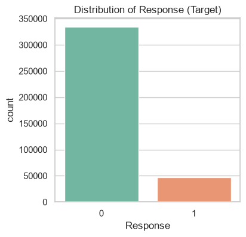
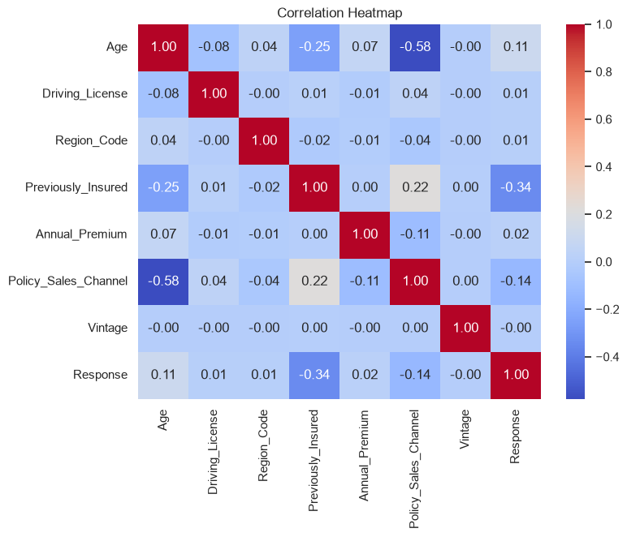
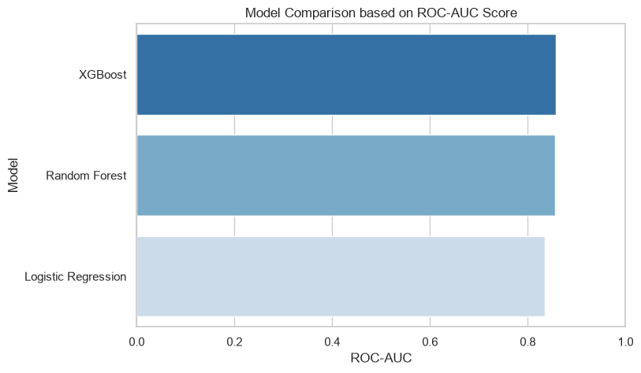

# Health Insurance Cross Sell Prediction

## Overview
This repository contains an end-to-end data science pipeline that predicts whether health insurance customers will be interested in purchasing vehicle insurance. The goal is to build an accurate predictive model that helps the insurance company target the right customers, optimizing their cross-selling strategy and maximizing revenue.

## Dataset & Feature Details
This dataset is collected from a Health Insurance company trying to predict whether their past customers would be interested in purchasing a new Vehicle Insurance policy from them. 

**Customer Demographics:**
* **`Age`**: Age of the customer.
* **`Gender`**: Gender of the customer (Male / Female).
* **`Region_Code`**: Unique code for the region of the customer.

**Vehicle Information:**
* **`Driving_License`**: 1 if the customer has a valid license, 0 otherwise.
* **`Vehicle_Age`**: Age of the vehicle (`< 1 Year`, `1-2 Year`, `> 2 Years`).
* **`Vehicle_Damage`**: Yes if the customer's vehicle was damaged in the past, No otherwise.

**Policy Details:**
* **`Previously_Insured`**: 1 if the customer already has vehicle insurance, 0 otherwise.
* **`Annual_Premium`**: The amount the customer pays for their health insurance premium.
* **`Policy_Sales_Channel`**: Anonymized code for the channel used to reach the customer (e.g., mail, phone, agent).
* **`Vintage`**: Number of days the customer has been associated with the company.

**Target Variable:**
* **`Response`**: The prediction target. 1 means the customer is interested in vehicle insurance, 0 means they are not.
   
  
  *The target variable is highly imbalanced, with only ~12% of customers interested in vehicle insurance.*

## Key Features
* **Exploratory Data Analysis (EDA):** Visualized feature distributions and analyzed the relationship between categorical/numerical features and the target variable.
   
  
* **Data Preprocessing & Encoding:** 
  * **Missing Values & Duplicates:** Verified data integrity (no missing values were found) and dropped the irrelevant `id` column.
  * **Categorical Encoding:** Applied `LabelEncoder` for binary variables (`Gender`, `Vehicle_Damage`) and mapped `Vehicle_Age` manually to preserve its ordinal nature (`< 1 Year`: 0, `1-2 Year`: 1, `> 2 Years`: 2).
  * **Feature Scaling:** Applied targeted Feature Scaling (`StandardScaler`) exclusively to continuous numerical columns (`Age`, `Annual_Premium`, `Vintage`) to prevent distortion of encoded categorical variables.
  * **Data Subsetting:** Utilized 100% of the dataset for training to maximize information retention instead of downsampling.
* **Machine Learning Models & Hyperparameter Tuning:** 
  * **Logistic Regression:** Used as a baseline model, trained with `class_weight='balanced'`.
  * **Random Forest Classifier:** An ensemble tree model, tuned with `n_estimators=200`, `max_depth=12`, and `class_weight='balanced'` to prevent overfitting and handle class distribution.
  * **XGBoost Classifier:** A powerful gradient boosting model, tuned with `learning_rate=0.1`, `n_estimators=200`, `max_depth=6`. The exact positive class ratio was calculated and passed to `scale_pos_weight` to perfectly handle the imbalanced labels.

## Project Structure
* `health_insurance_project.ipynb`: A Jupyter Notebook containing step-by-step code, documentation, and visualizations for the entire ML pipeline.
* `health_insurance_project.py`: A streamlined Python script of the end-to-end pipeline.

## Evaluation & Results
Because only ~12% of the customers in this dataset are actually interested in vehicle insurance, the classes are highly imbalanced. In this scenario, a model could simply predict "Not Interested" for everyone and still achieve 88% Accuracy. Therefore, traditional Accuracy is heavily misleading. 

Instead, the models were evaluated on the following robust metrics:
* **ROC-AUC:** Measures the model's ability to distinguish between interested and non-interested customers across all classification thresholds. This was our primary metric for overall performance.
* **Recall (Sensitivity):** Out of all the customers who *were* actually interested, how many did the model correctly identify? This is critical because the business wants to ensure they don't miss out on potential cross-sell opportunities.
* **Precision:** Out of all the customers the model *predicted* were interested, how many were actually interested?
* **F1-Score:** The harmonic mean of Precision and Recall, providing a single metric that balances both.

| Model | Accuracy | Precision | Recall | F1-Score | ROC-AUC |
|-------|----------|-----------|--------|----------|---------|
| **XGBoost** | 0.7129 | 0.2882 | 0.9135 | 0.4382 | **0.8575** |
| **Random Forest** | 0.6989 | 0.2804 | 0.9302 | 0.4310 | 0.8559 |
| **Logistic Regression** | 0.6402 | 0.2511 | 0.9763 | 0.3995 | 0.8343 |

**Results Summary:**
* **XGBoost** performed the best out of the three models, effectively capturing complex non-linear relationships and achieving the highest ROC-AUC score.
* The explicit handling of class imbalances drastically improved the Recall and F1-Score across all models compared to default unweighted implementations, ensuring the business doesn't miss out on potential cross-sell customers.

## How to Run
1. Clone the repository.
2. Download the [Kaggle Dataset](https://www.kaggle.com/datasets/anmolkumar/health-insurance-cross-sell-prediction) and place the `train.csv` file in the root directory.
3. Run the Jupyter Notebook `health_insurance_project.ipynb` to view the analysis and train the models.
